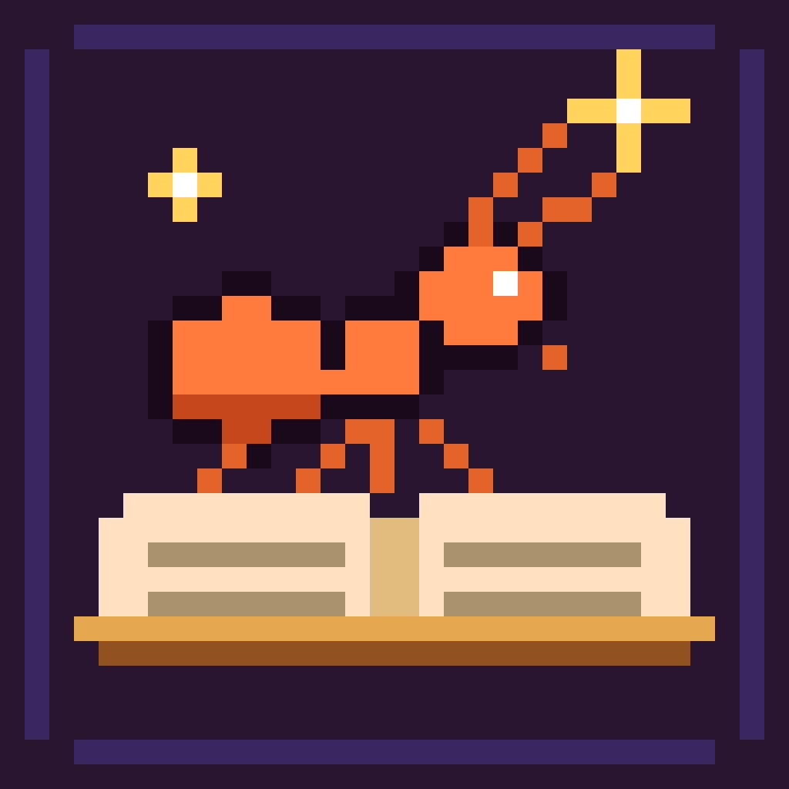

# PONSFABLE



A pixel AI chat — like Claude or ChatGPT, in a colony skin. Formi writes, codes, plans, and tells fables.

```bash
cp .env.example .env   # then paste your XAI_API_KEY from https://console.x.ai
npm install
npm run dev            # http://localhost:5173
```

Without a key the UI still runs in a demo nest (canned replies). With `XAI_API_KEY` set, messages stream from **grok-4.6** on the SpaceXAI / xAI API. The key stays on the Vite server — it is never shipped to the browser.

Chats are stored in this browser (`localStorage`).

Official **$FABLE** contract: `0xe6b6d29bcf3484121a074ec161489899d010b36c` — shown on the hero and in the header. Trust only this address.
